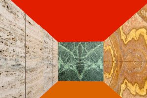

  

# Project 3D mazze [Cub3d](doc/PDF/cub3D_subject.pdf)

Cub3d is an immersive project offered by 42 Berlin that dives into the world of ray-casting, an essential technique in computer graphics. The main goal of the project is to create a 3D graphical representation of a maze-like environment from a 2D map, similar to the early 3D games like Wolfenstein 3D.

### Key Objectives:
1. **Understanding Ray-Casting**: Students will learn the fundamentals of ray-casting, a technique used to render 3D scenes by calculating the path of rays from the viewer's perspective and detecting intersections with objects in the environment.
2. **Field of View (FOV)**: The project incorporates a 60° FOV, challenging students to accurately project a 3D view from a 2D grid map.
3. **Grid Mapping**: Participants will transform a given map into a 2D grid and use this to navigate and render the 3D maze.
4. **Intersection Calculations**: The project involves calculating both vertical and horizontal intersections to determine the distances to walls and render the scene accurately.
5. **Rendering Multiple Rays**: Students will calculate and render multiple rays within the FOV to create a complete and immersive 3D view.

### Learning Outcomes:
- **Enhanced C Programming Skills**: The project is designed to deepen students' understanding of C programming through practical application.
- **Algorithmic Thinking**: Students will develop their problem-solving skills by implementing complex algorithms for ray-casting and rendering.
- **Graphics Programming**: The project introduces students to the basics of graphics programming, setting a foundation for more advanced topics in computer graphics and game development.

Cub3d is not just about coding; it's about bringing together math, logic, and creativity to create an engaging virtual experience. By the end of the project, students will have a solid grasp of ray-casting and a completed 3D maze exploration game to showcase their skills.

Main Concept of [Raycasting](doc/info/Calculation_the_Ray.md) with the DDA (Digital Differential Analyzer)
