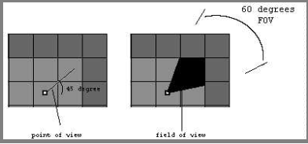
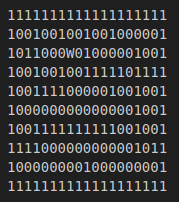
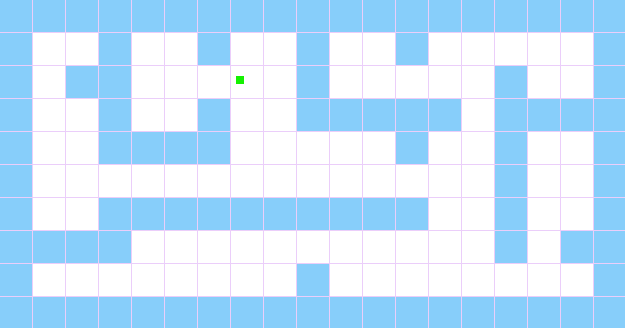
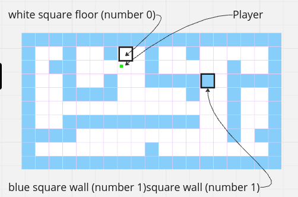
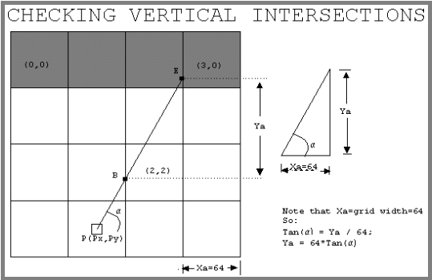
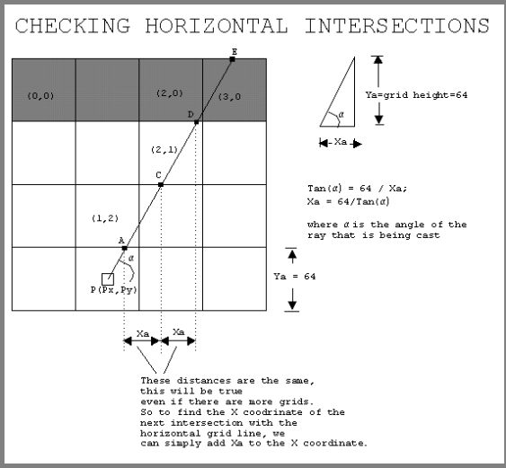
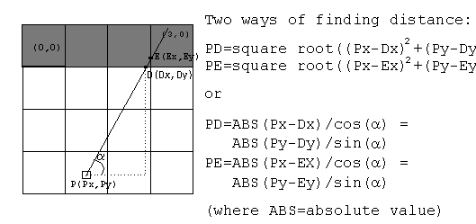
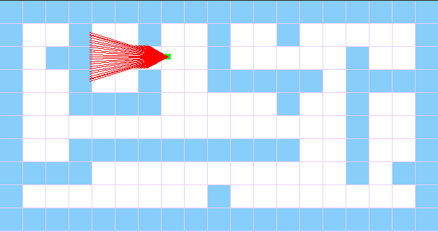

# Calculating the Ray

## Important Details
- Our Field of View (FOV) is 60°.

  

## Calculation Steps

### 1. Determine a Grid for the Given Map

A maze like the one shown here can be converted from the given map into a 2D grid map.

  

  

  

  

### 2. Ray Calculation Process

#### 1. Calculate Vertical Intersections for the Next Column (Fig 5)

  

Steps for finding intersections with vertical grid lines:

1. Find the coordinates of the first intersection (point B in this example). Since the ray is moving to the right in the image, B.x = rounded_down(Px/64) * (64) + 64. If the ray were moving to the left, B.x = rounded_down(Px/64) * (64) - 1. Calculate A.y = Py + (Px - A.x) * tan(ALPHA).

2. Find Xa. (Note: Xa is just the width of the grid. If the ray is moving to the right, Xa will be positive; if the ray is moving to the left, Xa will be negative.)

3. Find Ya using the equation above.

4. Check the grid at the intersection point. If there is a wall on the grid, stop and calculate the distance.

5. If there is no wall, extend the ray to the next intersection point. Note that the coordinates of the next intersection point (Xnew, Ynew) are simply Xnew = Xold + Xa and Ynew = Yold + Ya.

#### 2. Calculate Horizontal Intersections

  

#### 3. Compare Horizontal and Vertical Intersections

  

[link](https://permadi.com/1996/05/ray-casting-tutorial-7/)

### Calculate Multiple Rays for the Field of View

  

