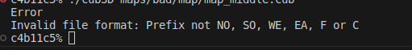

# Note

## Error 


better
```
Error
Invalid file format:
Map must be fileending *.cub
Map Struckture: 
---
NO  <path texture>
SO  <path texture>
WE  <path texture>
EA  <path texture>

F <RGB>
C <RGB>

Your Map 
```

## Check 
```bash
c4b11c5% ./cub3D maps/bad/map/map_only.cub
```
Error: get a --> `core dumped`  
```       
Error
Invalid file format: Prefix not NO, SO, WE, EA, F or C
zsh: segmentation fault (core dumped)  ./cub3D maps/bad/map/map_only.cub
```

## Check 
```
c4b11c5% ./cub3D maps/bad/player/player_on_edge.cub 
```
Error: Map starting but get a --> `core dumped` 
```
zsh: segmentation fault (core dumped)  ./cub3D maps/bad/player/player_on_edge.cub
```

## Check 
```bash
./cub3D maps/bad/textures/textures_dir.cub  
```        
Error: get a --> `core dumped`
```
MLX42: LodePNG: failed to open file for reading
zsh: segmentation fault (core dumped)  ./cub3D maps/bad/textures/textures_dir.cub
```

## Check 
Argruments to start 
