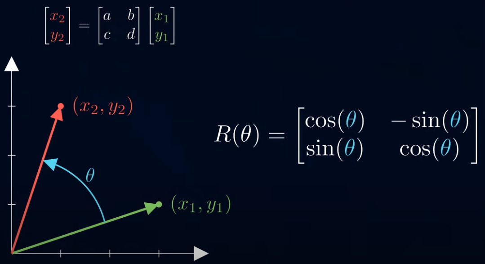

# 2D Vector Rotation in Computer Graphics and Game Development

In computer graphics and game development, vector rotation in the 2D plane is frequently used to change the orientation of objects or the camera. The rotation of a vector is accomplished by multiplying it with a rotation matrix. This matrix is based on the trigonometric functions cosine and sine.

## References

- [Trigonometric Functions: Cosine and Sine](https://en.wikipedia.org/wiki/Trigonometric_functions)
- [2D Rotation Matrix](https://en.wikipedia.org/wiki/Rotation_matrix#2D)

